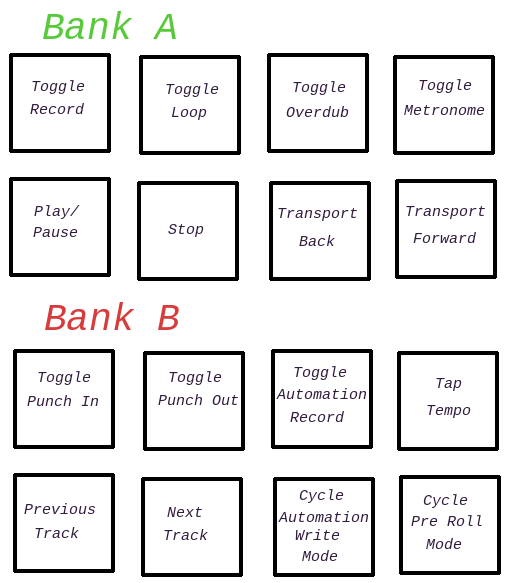

# MPK Mini MKII Programs + Controller Scripts for Bitwig

The original controller script for the MPK mini MkII seems to have been thoroughly abandoned, and no longer works with (at least) newer versions of Bitwig. I had planned on simply fixing that up but I ended up completely gutting it making a brand new controller

# Installation

Clone this repo into your Controller Scripts directory which by default is:

* Linux: _~/Bitwig Studio/Controller Scripts/_

* Windows: _%USERPROFILE%\\Documents\\Bitwig Studio\\Controller Scripts\\_

* Mac: _~/Documents/Bitwig Studio/Controller Scripts_

(You can clone it wherever you want, just make sure the contents of `controller-scripts/` end up within your Controller Scripts somehow

Then using the MPK MkII Editor, load _at least_ `program1.mk2` from `mk2-programs/` onto your MPK (The controller script currently only provides mappings for the first program, so the other 3 can be free for other uses if you want)

# How to use

## Program 1

The 8 knobs are mapped to the currently selected remote controls page of the currently selected device.

When in neither CC nor PROG CHANGE mode, the drum pads map from C1 to D#2, which should match with most of the drum machine presets that come with Bitwig.

When in PROG CHANGE mode, the drum pads will allow you to jump between up to 16 of the remote control pages of the currently selected device.

When in CC mode, the drum pads have the following mapping:

There are still 3 pads that do nothing, I'm open to suggestions.

The Joystick maps to pitch bend on the Y axis, and send MIDI CC messages centered around 60 on the X axis (you can have it to send 0-127 on either side with separate data1 bytes via the MkII Editor, if you want). This you can map the usual way by selecting any control you want.

## Programs 2-4

N/A

